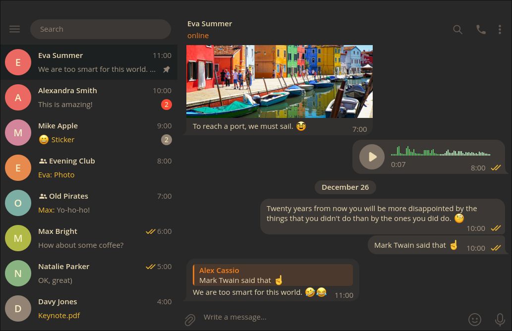

Fork of [gruvbox theme](https://github.com/indev29/telegram-gruvbox) for [tdesktop](https://github.com/telegramdesktop/tdesktop) to look more simple and consistent with my setup.

## Installation

1. Download `gruvbox.tdesktop-theme` from the [releases page](https://github.com/sagayda/telegram-gruvbox/releases).
2. Use Settings menu to select the theme or just send `gruvbox.tdesktop-theme` to yourself in Telegram and click on the message.
3. Click "Apply this theme".
